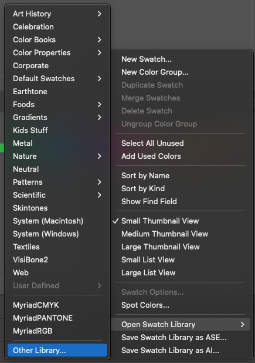
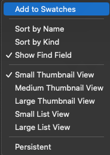

# Building a Custom Automation for Illustrator

| Author: *Lee Whittaker* | Date: *Jan 17, 2024* |
|-------------------------|---------------------:|

**Table of Contents**
- [Introduction](#introduction)
- [Illustrator Scripting](#illustrator-scripting)
- [The Process](#the-process)
    - [Step 1: Accessing The Swatch](#step-1-accessing-the-swatch)
    - [Step 2: Duplicating Existing Files](#step-2-duplicating-existing-files)
    - [Step 3: Recursive Recoloring](#step-3-recursive-recoloring)
    - [Step 4: Saving and Exporting](#step-4-saving-and-exporting)
- [Final Thoughts](#final-thoughts)

## Introduction

I was recently assigned the task of taking old logos of various products sold by a client and updating the colors on various elements to match a new rebranding strategy. Basically, I needed to export 19 copies of each logo:

> **Print Files** (7)
> | File Type | CMYK Color | Pantone | Black  | White  |
> |:---------:|:----------:|:-------:|:------:|:------:|
> | .EPS      | &#9745;    | &#9745; | &#9745;| &#9745;|
> | .PDF      | &#9745;    | &#9744; | &#9745;| &#9745;|

> **Digital Files** (12)
> | File Type | RGB Color | Black  | White  |
> |:---------:|:---------:|:------:|:------:|
> | .PDF      | &#9745;   | &#9745;| &#9745;|
> | .SVG      | &#9745;   | &#9745;| &#9745;|
> | .JPG      | &#9745;   | &#9745;| &#9745;|
> | .PNG      | &#9745;   | &#9745;| &#9745;|

This process took me 4 hours to do on the first logo because it also was broken down into 5 languages: *English*, *French*, *Italian*, *Portuguese*, and *Spanish*. So a total of 95 files were created through the tedious process of `File > Save a Copy` or `File > Export > Export As`.

This was the first of 25 logos. The client shouldn't be expected to pay my hourly wages ($60 per hour) for 100 hours ($6,000) of labor just to update the colors of a few logos. There had to be a faster way.

## Illustrator Scripting 
The solution was to automate the process through Illustrator Scripting. 

The process was thus:

- Open a `.eps` file of the old logo.
- Verify it is in CMYK mode.
- Apply the primary and secondary colors to the logo from the provided Pantone `.ase` swatch library file.
- `Save a Copy` as a `...Pantone.eps` file in the designated `Print` folder.
- Apply the primary and secondary colors from the provided CMYK `.ase` swatch library file.
- `Save a Copy` as a `...Color.eps` file in the designated `Print` folder.
- `Save a Copy` as a `...Color.pdf` file in the designated `Print` folder.
- Convert the file to RGB mode.
- Apply the primary and secondary colors from the provided RGB `.ase` swatch library file.
- `Save a Copy` as a `...Color.pdf` file in the designated `Digital` folder.
- `Export` as a `...Color.jpg` file in the designated `Digital` folder.
- `Export` as a `...Color.png` file in the designated `Digital` folder.
- `Export` as a `...Color.svg` file in the designated `Digital` folder.
- Apply `#000000` (black) to primary and secondary logo elements.
- `Save a Copy` as a `...Black.eps` file in the designated `Print` folder.
- `Save a Copy` as a `...Black.pdf` file in the designated `Print` folder.
- `Save a Copy` as a `...Black.pdf` file in the designated `Digital` folder.
- `Export` as a `...Black.jpg` file in the designated `Digital` folder.
- `Export` as a `...Black.png` file in the designated `Digital` folder.
- `Export` as a `...Black.svg` file in the designated `Digital` folder.
- Apply `#FFFFFF` (white) to primary and secondary logo elements.
- Set the artboard setting to a colored background.
- `Save a Copy` as a `...White.eps` file in the designated `Print` folder.
- `Save a Copy` as a `...White.pdf` file in the designated `Print` folder.
- `Save a Copy` as a `...White.pdf` file in the designated `Digital` folder.
- `Export` as a `...White.jpg` file in the designated `Digital` folder.
- `Export` as a `...White.png` file in the designated `Digital` folder.
- `Export` as a `...White.svg` file in the designated `Digital` folder.

I began looking for a way to do this EXACT process via scripting since it was so repetitive and consistent with each logo.

## The Process

I went through a lot of trial and error getting all the pieces working. It took me another 4 hours to perfect the script and run through the automation.

- [Step 1: Accessing The Swatch](#step-1-accessing-the-swatch)
- [Step 2: Duplicating Existing Files](#step-2-duplicating-existing-files)
- [Step 3: Recursive Recoloring](#step-3-recursive-recoloring)
- [Step 4: Saving and Exporting](#step-4-saving-and-exporting)

---

### Step 1: Accessing The Swatch

When running a `.jsx` script in the Adobe Illustrator application, it automatically gives you access to its internal libraries, so commands like `app` don't need any lookups or constructors. It's all right there.

```JavaScript
// Select the color from the Black swatch.
var black = app.activeDocument.swatches.getByName("Black").color;
```

So to get my client's branded colors from their swatches, I first had to import the swatch library into the project. Select the Swatches tab, and from the hamburger menu to the right of the tabs of that window you'll see the following menu:



Find your `.ase` file(s) and import them one by one.

Then select the swatches you want to import into the project and use the same sandwich menu as before, but with the new library tab selected, choose "Add to Swatches".



This action is required to be able to access those swatches in the script. By default, Illustrator doesn't grant access to `.ase` files or imported libraries *until* they're added to the main Swatch.

All that's left is to make sure you get the names of your swatches exactly as they appear when you hover your mouse icon over them.

Then you can use those names to access those colors:

```JavaScript
// TARDIS Blue
var primaryPantone = app.activeDocument.swatches.getByName("PMS 2955 C");
var primaryCYMK = app.activeDocument.swatches.getByName("Tardis CYMK"); // 100,55,10,48
var primaryRGB = app.activeDocument.swatches.getByName("Tardis RGB"); // #003B6F
```

---

### Step 2: Duplicating Existing Files

In my particular case, having to switch modes between CMYK and RGB, there is no simple programmatic way to do that. Instead, I had to create a duplicate file that started in RBG or CMYK color mode and go from there. So here's how I did it:

```JavaScript
// Get the active document
var doc = app.activeDocument;

...

// Clone and save a new CMYK doc
var newDoc = app.documents.add(DocumentColorSpace.CMYK, doc.width, doc.height);
copyLayers(doc, newDoc);
newDoc.saveAs("new/doc/path/" + "new-file-name.ai");

...

/**
 * Copies all layers from the old document to the new document.
 * 
 * @param {Document} oldDoc - The original document to copy layers from.
 * @param {Document} newDoc - The new document to copy layers to.
 */
function copyLayers(oldDoc, newDoc){
    for (var i = 0; i < oldDoc.layers.length; i++) {
        var layer = oldDoc.layers[i];
        var newLayer = newDoc.layers.add();
        newLayer.name = layer.name;

        for (var j = 0; j < layer.pageItems.length; j++) {
            var pageItem = layer.pageItems[j];
            pageItem.duplicate(newLayer, ElementPlacement.PLACEATEND);
        }
    }
}
```

---

### Step 3: Recursive Recoloring

This step gave me the most trouble figuring out. I could not, for the life of me, understand why the colors weren't working. The solution is that sublayers of type `CompoundPathItem` do not have a `.fillColor` themselves, but instead have an array of `PathItems` which do, even if flattened.

So to recursively go through a selected layer and make every element in it the same color, I used the following code:

> Note, this code depends on one layer being named "Primary" and all the objects inside of it is intended to be recolored the new primary colors.

```JavaScript

// primaryRGB was set in step 1

var primaryLayer = newDoc.layers.getByName("primary");
recolorItems(primaryLayer, primaryRGB);

...

/**
 * Recolors the items recursively.
 * @param {CompoundPathItem|GroupItem|Layer|PageItem|PathItem|TextFrame} item - The item to recolor.
 * @param {Color} fillColor - The new fill color.
 */
function recolorItems(item, fillColor){
    if(item.typename === "GroupItem" || item.typename === "Layer") {
        for(var i = 0; i < item.pageItems.length; i++){
            recolorItems(item.pageItems[i], fillColor);
        }
    }
    else if (item.typename === "CompoundPathItem" ){
        for(var j = 0; j < item.pathItems.length; j++){
            recolorItems(item.pathItems[j], fillColor);
        }
    }
    else if(item.typename === "PathItem") {
        item.fillColor = fillColor;
    }
    else if(item.typename === "TextFrame") {
        item.textRange.fillColor = fillColor;
    }
    else {
        alert("Unknown item type: " + item.typename);
    }
}
```

---

### Step 4: Saving and Exporting

The file types I needed to export included `.eps`, `.pdf`, `.jpg`, `.png`, and `.svg`. The first two are types that can be created through the `Save As` process. The latter three are `Export` only options. 

So the first step was to set up save options:

```JavaScript
// Set Save Options
var epsSaveOpts = new EPSSaveOptions();
var pdfSaveOpts = new PDFSaveOptions();
var exportJPEG = new ExportOptionsJPEG();
var exportPNG = new ExportOptionsPNG24();
var exportSVG = new ExportOptionsSVG();
```

Each of these objects are used to define the settings for saving or exporting those file types. They can be modified, but I'm okay with the defaults.

When saving files, here is the way to go:

```JavaScript
// Save as files
newDoc.saveAs("filename.eps", epsSaveOpts);
newDoc.saveAs("filename.pdf", pdfSaveOpts);

// Export files
newDoc.exportFile("filename.jpg", ExportType.JPEG, exportJPEG);
newDoc.exportFile("filename.png", ExportType.PNG24, exportPNG);
newDoc.exportFile("filename.svg", ExportType.SVG, exportSVG);
```

## Final Thoughts

With the script in place, the process of updating and exporting the logos became significantly more efficient. What initially took 4 hours per logo was now a matter of minutes. This not only saved time but also reduced the potential for manual errors.

The automation script was able to handle the repetitive tasks, allowing me to focus on more complex aspects of the project. This efficiency gain translated directly into cost savings for the client and allowed for a quicker turnaround time.

### Lessons Learned
- **Automation is key for repetitive tasks:** This project highlighted the importance of automation in graphic design workflows. By automating the color update and file export process, I saved countless hours of manual work.
- **Scripting is a valuable skill in design:** Having the ability to write scripts for Adobe Illustrator or other design software opens up a world of possibilities for customizing and streamlining workflows.
- **Test and refine:** Developing the script required trial and error. It's important to test each part of the process and refine the script to ensure it works smoothly.

### Future Improvements

At this time I have no intention to continue working on this project. It does its job. In the event another project like this comes up, I'll be able to come back to this project and work from it.

### Sharing the Knowledge

I believe in the power of sharing knowledge. That's why I've decided to make this script available to other designers who might find it useful. [See the code.](https://github.com/Okomikeruko/illustrator-scripts/blob/master/brand-recolor.jsx)

### Your Thoughts?

I'd love to hear from other designers who have embarked on similar automation journeys. How have you used scripting to improve your workflow? Feel free to share your experiences in the comments below!
